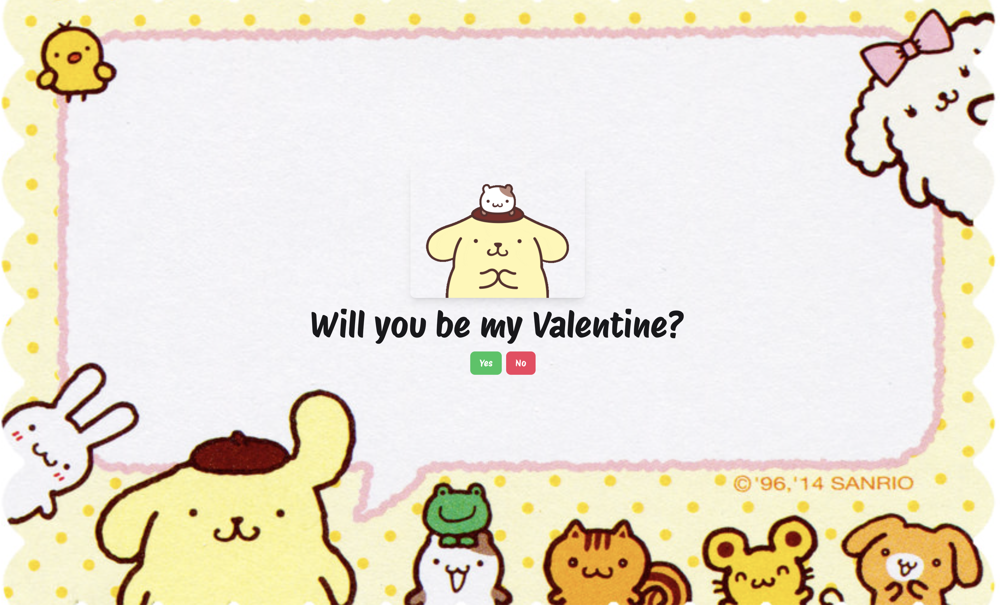

# 💘 Will You Be My Valentine? 💘



Hi there! This is a sweet little project I built to ask a very special person a very important question — **"Will you be my Valentine?"** ❤️

---

## 🌹 About This Project

This is a light-hearted and fun interactive React app powered by **Vite**. It’s designed to be charming and a bit cheeky — just enough to bring a smile (and hopefully a “yes!” 😊).

---

## ✨ Features

- Wholesome and playful UI  
- Adorable animations and styling  
- Sneaky buttons that make saying "no" a little tricky 😉  
- A joyful, personalized Valentine's experience

---

## 🛠️ Getting Started

Want to run or remix it?

1. Clone this repository:
   ```bash
   git clone https://github.com/your-username/your-repo-name.git
2. Install dependencies:
   ```bash
   npm install
3. Run the development server:
   ```bash
   npm run dev


## 🙏 Acknowledgements

This project is inspired by [Anish (xeven777)](https://github.com/xeven777)’s original [Valentine app](https://github.com/xeven777/Valentines-2024).  
Huge thanks for the charming idea — I customized it to make it my own 💝
